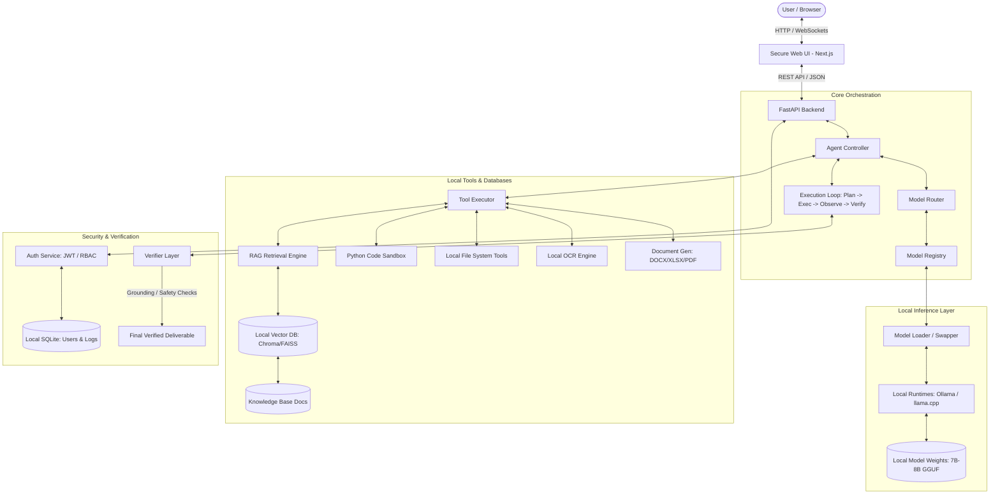

# AEGIS — PROJECT MASTER SPECIFICATION

---

## 1. Project Identity

* **Project Name:** AEGIS — Sovereign AI Workbench
* **Team:** Team Aegis
* **Problem Statement ID:** SIH26117
* **Problem Statement Title:** Sovereign On-Premise Agentic AI Workbench using Open-Weight Multimodal LLMs for Confidential Industrial Work
* **Organization:** Mangalore Refinery and Petrochemicals Limited (MRPL)
* **Department:** Mangalore Refinery and Petrochemicals Limited (MRPL)
* **Category:** Software
* **Theme:** Smart Automation
* **Repository:** [https://github.com/KShruti772/SIH26117.git](https://github.com/KShruti772/SIH26117.git)

---

## 2. SIH Problem Statement

The Smart India Hackathon Problem Statement **SIH26117** calls for the design and development of an on-premise, self-hosted, air-gapped "Agentic AI Workbench". The primary objective is to allow organizations handling highly confidential industrial data (such as refineries, defence contractors, and PSUs) to leverage advanced generative AI, agentic planning, and multimodal analysis. 

Crucially, the system must run entirely on local, open-weight models without relying on public cloud APIs (e.g., OpenAI, Claude, Gemini). The backend must support multiple specialized open-weight models (text, coding, vision) and feature a mechanism to dynamically route tasks, load/unload models according to system resource constraints, execute local tools in a sandbox, retrieve knowledge via local Retrieval-Augmented Generation (RAG), verify outcomes, and compile structured deliverables (DOCX, XLSX, PDFs).

---

## 3. Problem Being Solved

Industrial knowledge work within enterprises like MRPL involves sensitive documents containing intellectual property, process secrets, and security hazards:
* **Engineering Drawings & P&IDs:** Piping layouts, instrumentation diagrams, and equipment specs.
* **Inspection & Maintenance Reports:** Corrosion studies, refinery turnaround logs, and safety inspection notes.
* **Financial & Vendor Records:** Pricing sheets, bidding documentation, and contract negotiations.
* **Administrative Documentation:** Unreleased corporate policies, board memos, and legal briefs.

Using public LLM services (e.g., ChatGPT, Claude) exposes this data to external servers, violating data sovereignty regulations, internal corporate compliance, and national security guidelines.

---

## 4. Target Users

1. **Refinery Engineers & Operators:** Need to parse technical manuals, check equipment tolerances, and inspect P&ID layouts.
2. **Safety & Inspection Officers:** Require automated summaries of equipment inspections and draft safety approval notes.
3. **Procurement & Legal Teams:** Need to review vendor bids, compare contracts, and identify discrepancies without uploading documents to the cloud.
4. **IT Administrators:** Require a highly secure, offline-operable, and auditable system deployed within the private enterprise LAN.

---

## 5. Why Existing Cloud AI Is Unsuitable

* **Data Exposure Risk:** Cloud APIs retain prompt logs, risking the leak of proprietary engineering designs or negotiation notes.
* **Compliance Violations:** Government and PSU regulations strictly prohibit transmitting sensitive industrial data over public channels.
* **Internet Dependency:** Remote plants, offshore platforms, and highly secure industrial facilities operates in air-gapped zones where active internet access is blocked or highly restricted.
* **High Operational Costs:** API subscription fees and token-based pricing scale unpredictably compared to a one-time local hardware investment.

---

## 6. Proposed Solution

AEGIS is a **Self-Hosted, Air-Gapped, Agentic AI Workbench** that operates as an internal sovereign service. 

```
[CONFIDENTIAL DATA] 
       ↓
[LOCAL PROCESSING] 
       ↓
[LOCAL OPEN-WEIGHT AI (Ollama/llama.cpp)] 
       ↓
[AGENTIC EXECUTION (Plan-Execute-Observe-Verify)] 
       ↓
[LOCAL TOOLS & KNOWLEDGE BASE (RAG)] 
       ↓
[VERIFICATION LAYER] 
       ↓
[REAL DELIVERABLE (DOCX, XLSX, PDF)]
```

AEGIS integrates local LLMs (7B-8B parameter class) for planning, vision-OCR, and coding tasks with resource-aware orchestration to load/unload models on consumer-grade workstation hardware.

---

## 7. Aegis Core Principles

1. **Absolute Network Sovereignty:** Zero outbound network traffic to external cloud endpoints during standard execution.
2. **Dynamic Resource-Aware Orchestration:** Models are loaded on-demand and swapped out of VRAM dynamically to run multiple specialized tasks on memory-constrained hardware (e.g., 24GB VRAM).
3. **Rigorous Verification:** Agent outputs are validated by dedicated programmatic rules and test executions before delivery.
4. **Modularity & Open Standards:** The system backend interacts with model and tool abstractions, facilitating the addition of new models or runtimes without codebase refactoring.
5. **Auditable Security:** Every user action, model state change, and tool invocation is logged locally.

---

## 8. Functional Requirements

* **Local Inference Interface:** Provide a consistent API to interact with locally hosted LLMs.
* **Dynamic Model Registry & Routing:** Track model capabilities and route incoming prompts to the best-suited model.
* **Resource-Aware Swapping:** Automatically unload models from memory when they are inactive to make room for others.
* **Multimodal Document Parsing:** Extract text, run OCR on scanned documents, and process visual images.
* **Local Knowledge Base (RAG):** Store and retrieve chunked vector representations of internal documents using an offline vector store.
* **Execution Sandbox:** Run generated code in a safe, restricted local python process, capturing output and checking for errors.
* **Structured Document Generation:** Programmatically construct Microsoft Word (.docx), Excel (.xlsx), and PDF reports containing agent findings.
* **Multi-Step Agent Controller:** Break down complex requests into sub-tasks, execute tools, observe feedback, and self-correct.
* **Authentication & Audit Logs:** Secure interface access with roles (Admin, Authorized User, Viewer) and log all operations.

---

## 9. Non-Functional Requirements

* **Deployment Flexibility:** Must run on a single local development machine (e.g., MacBook Pro M5 Pro 24GB) and be packaging-ready for private LAN servers.
* **Memory Limits:** Must not exceed the host hardware limits (24GB Unified Memory / VRAM) when executing multi-model flows.
* **Offline Operation:** Zero internet connectivity required. All packages, runtime components, databases, and LLM weights must reside on local disks.
* **Latency Tolerances:** Task planning should respond within 15 seconds; model swapping overhead should not exceed 30 seconds.
* **Accuracy & Grounding:** Agent outputs must refer to documented facts retrieved from the local RAG database, maintaining a verifiable grounding rate.

---

## 10. System Architecture

The AEGIS architecture is strictly decoupled into a client UI, an orchestrating FastAPI backend, a resource-aware model manager, and localized tools.



---

## 11. Component Responsibilities

* **Secure Web UI:** Renders the dashboard, document upload widgets, model state monitors, chat panel, and file download interfaces.
* **FastAPI Backend:** Exposes secure REST endpoints, authenticates sessions, manages task threads, and routes network-sovereign requests.
* **Agent Controller:** Implements the core cognitive loop. It interprets user intent, compiles a checklist of operations, coordinates tool calls, and evaluates the final result.
* **Model Router & Registry:** Standardizes LLM requests. It parses requirements and selects the optimal local model based on capability metadata.
* **Model Loader/Swapper:** Checks available system memory and makes API calls to the local runtime (Ollama) to load the required model and unload idle models.
* **Local Tools:** Executable helper scripts that handle filesystem tasks, database queries, spreadsheet calculations, document generation, and OCR.
* **Verifier:** An autonomous validation agent and ruleset that parses outputs for compliance, grounding citations, code execution success, and template layout.

---

## 12. Agent Architecture

AEGIS employs a **Plan-Execute-Observe-Verify-Re-plan** loop:

```
[User Request] 
      ↓
[Plan] ──→ Compiles step-by-step execution graph.
      ↓
[Execute] ─→ Dynamically selects model and invokes local tool.
      ↓
[Observe] ─→ Captures console outputs, parsed files, or errors.
      ↓
[Verify] ──→ Programmatically inspects deliverables & constraints.
      ├── (Passed) ──→ [Deliver] ──→ Deliver verified artifacts.
      └── (Failed) ──→ [Re-plan] ─→ Feed error back to planner and loop.
```

The agent maintains state in a structured transaction log, ensuring every cognitive decision is trace-grounded.

---

## 13. Model Router Architecture

The Model Router avoids hard-coding model names within task modules. When the Agent Controller requests an AI output, it provides a task descriptor (e.g., `capability: "coding"`, `min_context: 4096`).
1. The Router queries the **Model Registry** for candidate models matching the requested capability.
2. It filters out models whose memory requirements exceed the currently available system memory.
3. It selects the model with the highest priority/efficiency rating.
4. It commands the **Model Loader** to ensure the selected model is active in memory.

---

## 14. Model Registry

The registry is configured via a local JSON or YAML schema, defining target profiles for locally-stored open-weight models:

```json
{
  "models": [
    {
      "model_id": "aegis-text-default",
      "name": "Llama-3-8B-Instruct-Q4_K_M",
      "type": "text",
      "capabilities": ["planning", "reasoning", "summarization"],
      "runtime": "ollama",
      "path": "llama3:8b-instruct-q4_K_M",
      "vram_requirement_gb": 5.2,
      "context_window": 8192,
      "status": "ready"
    },
    {
      "model_id": "aegis-vision-default",
      "name": "Qwen2-VL-7B-Instruct-Q4_K_M",
      "type": "vision",
      "capabilities": ["ocr", "image-analysis", "diagram-parsing"],
      "runtime": "ollama",
      "path": "qwen2-vl:7b-instruct-q4_K_M",
      "vram_requirement_gb": 6.5,
      "context_window": 32768,
      "status": "ready"
    },
    {
      "model_id": "aegis-coding-default",
      "name": "Qwen2.5-Coder-7B-Instruct-Q4_K_M",
      "type": "coding",
      "capabilities": ["code-generation", "debugging"],
      "runtime": "ollama",
      "path": "qwen2.5-coder:7b-instruct-q4_K_M",
      "vram_requirement_gb": 5.5,
      "context_window": 16384,
      "status": "ready"
    }
  ]
}
```

---

## 15. Dynamic Model Loading/Unloading

Because the target hardware (MacBook Pro M5 Pro 24GB Unified Memory) cannot comfortably hold all three models in RAM/VRAM simultaneously without causing thrashing or performance degradation, the **Model Loader** acts as a resource-aware manager:
* **Pre-load Checks:** When a model is selected, the loader checks active runtimes (e.g., via `GET http://localhost:11434/api/ps`).
* **Unload Routine:** If VRAM head-room is insufficient, the loader issues an unload API call (e.g., in Ollama, calling `/api/generate` with `keep_alive: 0` for the running model) to flush it.
* **Load Routine:** The loader sends a warm-up request to the target model to force it into memory.
* **Resource Guard:** Keeps a safety margin (e.g., 4GB) for OS operations and local tool runtimes.

---

## 16. Multimodal Pipeline

AEGIS processes complex mixed documents using a sequenced parsing pipeline:

```
[Document Upload] 
       ↓
[Format Detector]
 ├── Image (PNG/JPG) ──────────→ [Vision LLM (Qwen2-VL)] ──→ [Parsed Text/JSON]
 ├── Scanned PDF ──────────────→ [Page Splitter] ──→ [OCR Engine] ──→ [Structured Text]
 └── Native Document (DOCX/TXT) → [Direct Text Parser] ─────────────→ [Raw Text Stream]
       ↓
[Consolidated Markdown Text] ──→ [Agent Processor]
```

This prevents sending massive document chunks to the vision model if simple text extraction is possible, conserving hardware compute cycles.

---

## 17. OCR Pipeline

For scanned reports, piping diagrams, or low-quality screenshots:
* **Local Preprocessing:** Uses OpenCV or PIL to adjust image contrast, desksweep, and scale resolution to improve reading accuracy.
* **Execution:** Invokes a local, containerized OCR engine (e.g., EasyOCR or Tesseract) to perform layout-aware text block segmentation.
* **Vision LLM Integration:** If text layout is crucial (like forms, tables, or engineering specs), the Qwen2-VL model processes page crops to extract tabular key-value pairs directly.

---

## 18. RAG Architecture

The local knowledge base operates fully offline:

```
[Internal Documents (.pdf, .docx, .xlsx, .txt)]
       ↓
[Document Parsers (PyPDF, docx-parser)]
       ↓
[Chunking Engine (Recursive Character Splitting, 500-1000 char size)]
       ↓
[Local Embedding Model (HuggingFace sentence-transformers/all-MiniLM-L6-v2)]
       ↓
[Local Vector Database (ChromaDB / FAISS storing vectors locally)]
       ↓
[Semantic Query Retrieval] ──→ [Top-K Relevant Passages] ──→ [LLM Context Window]
```

---

## 19. Local Knowledge Base

* **Storage Path:** Stored locally in `data/knowledge_base/` and vector database indexes in `d:\SIH26117\vectorstore`.
* **Ingestion:** Periodic directory scanner watches for new PDFs or logs, processes them, updates the vector indexes, and creates a local catalog metadata file.
* **Grounding:** Injected passages are wrapped with XML tags (e.g., `<evidence id="SOP-01">...</evidence>`) so that the verifier can track text sources.

---

## 20. Local Tool Architecture

Tools are implemented as isolated Python functions complying with a standardized wrapper interface:

```python
class BaseTool:
    name: str
    description: str
    args_schema: dict
    
    def run(self, **kwargs) -> dict:
        # Executes local logic
        # Returns structured dictionary {"status": "success/error", "data": ...}
```

The Agent Controller maps LLM tool call outputs to these classes, executes them locally, and logs outputs into the context window.

---

## 21. Code Sandbox

To prevent generated code from damaging host resources, freezing the application, or attempting unauthorized network outbound calls:
* **Process Isolation:** Runs code using standard Python subprocesses under restricted environment variables.
* **Resource Limits:** Restricts execution time (e.g., max 10-second timeout) and blocks network access using OS-level wrappers if deployed on Linux (e.g., using `firejail` or isolated container runtimes).
* **Capture:** Safely pipes `stdout` and `stderr` to standard output variables.
* **Return Code Check:** Validates that code exits with status code `0`.

---

## 22. Spreadsheet Processing

* **Parsing:** Uses `pandas` and `openpyxl` to extract sheet sheets, cell formulas, and row arrays.
* **Manipulation:** Allows the agent to write calculations, generate summary charts, and write data blocks.
* **Auditability:** Retains a shadow ledger of values to ensure calculated formulas match hard-coded outputs generated by the agent.

---

## 23. Document Generation

AEGIS converts raw text outcomes into professional files:
* **DOCX (python-docx):** Generates structured reports using predefined organizational headers, titles, styles, and table borders.
* **PDF (reportlab):** Compiles official document formats, tables, and watermarks.
* **XLSX (openpyxl):** Creates formatted tables with colored headers and custom formulas.

---

## 24. Verification Layer

Outputs are not directly pushed to the user interface. The Verifier executes automatic rules:
1. **Source Grounding Check:** Ensures generated facts refer to specific IDs from retrieved RAG documents.
2. **File Validation:** Checks that output documents exist on disk and possess non-zero file sizes.
3. **Format Parsing:** Validates JSON structures, markdown tables, or specific code syntax.
4. **Code Execution Test:** Runs generated scripts in the Sandbox and validates that the output matches expectations.
5. **Human-in-the-loop Hook:** Optionally routes high-impact reports to user approval screens before deployment.

---

## 25. Security Architecture

Because AEGIS operates in sensitive zones, security controls are integrated directly into the system deployment layer:

```
[Private LAN Interface]
        │
        ├── [Nginx Reverse Proxy]
        │         │
        │         ├── [JWT Authentication Filter]
        │         │         │
        │         │         ├── [Role-Based Access Control (RBAC)]
        │         │         │         │
        │         │         │         └── [FastAPI Core Application]
        │         │         │                   │
        │         │         │                   └── [Audit Log Ledger (SQLite)]
```

---

## 26. Authentication / Authorization

* **User Authentication:** Simple local database containing hashed password credentials (using bcrypt).
* **Role-Based Access Control (RBAC):**
  * `Admin`: Can add/edit local model endpoints, upload RAG documents, and inspect system audit logs.
  * `Authorized User`: Can run agents, invoke sandboxes, compile documents, and perform analyses.
  * `Viewer`: Can read generated deliverables, review audit logs, and search knowledge index files.

---

## 27. Audit Logging

* **Target Database:** Written to a local SQLite database (`data/private/audit.db`) or structured JSON logs.
* **Fields Logged:** Timestamp, User ID, User IP, Requested Action, Model Selected, Tools Invoked, Sandbox Exit Codes, Verification Status, and File Export Paths.
* **Integrity:** The logs are append-only; deleting or editing logs is restricted at the application level.

---

## 28. Private LAN Architecture

During the prototype phase, AEGIS runs as a local service on the MacBook Pro. To prove LAN capability:
* The host is assigned a static IP on the local Wi-Fi router.
* FastAPI listens on `0.0.0.0:8000` to allow client requests from other devices in the same subnet.
* A reverse proxy (e.g., Nginx) is configured to handle traffic, routing UI and WebSocket channels securely.

---

## 29. Air-Gapped Architecture

To function without internet access, AEGIS bundles all requirements:
* **Models:** All model weights (GGUF or HuggingFace files) are downloaded in advance and stored in the `models/` directory or Ollama's local storage path.
* **Python Environments:** A dedicated offline directory caches raw wheels so that running `pip install --no-index --find-links=./wheels` works.
* **Frontend Packages:** Pre-compiled static exports (via `next build` and `next export`) eliminate the need to run NPM registries offline.
* **OCR & Tools:** Runtimes include local system binaries (e.g., local tesseract-ocr binaries) packaged inside the environment setup.

---

## 30. Network Sovereignty Proof

During live hackathon demonstrations, the team will prove that no external cloud communication occurs:
* **Network Logging:** Running a local network traffic monitor (e.g., Wireshark or `tcpdump`) filtering on target outbound ports.
* **Physical Disconnect:** Physically disconnecting the host machine's internet cable or turning off the router's WAN uplink.
* **Execution Validation:** Demonstrating that the system still performs full OCR, RAG retrieval, agentic planning, and document compilation with zero network access.

---

## 31. Hardware Constraints

The primary target platform is:
* **Device:** MacBook Pro M5 Pro
* **Unified Memory:** 24 GB RAM
* **SSD Capacity:** 1 TB PCIe SSD (+ 900 GB external drive)

### Critical Quantitative Realities:
* **Model Size Limitation:** Cannot simultaneously run multiple model weights exceeding 12-14 GB in memory.
* **Quantization Target:** Quantized 4-bit (`Q4_K_M`) models are selected to reduce memory usage by ~50% compared to float16.
* **Loading Delays:** Swapping models on unified memory takes approximately 5 to 15 seconds. High concurrent loads are limited.
* **No 120B Inference:** 120B or 70B parameter models cannot run on this hardware profile; attempts will cause system freeze or heavy swap thrashing. Target models are strictly kept between 7B and 8B parameters.

---

## 32. Model Strategy

To optimize processing on 24GB Unified Memory, AEGIS employs:
1. **Task Planner / Reasoning Model:** `Llama-3-8B-Instruct-Q4_K_M` (Fast response, high context coherence, standard tool-calling compatibility).
2. **Coding Model:** `Qwen2.5-Coder-7B-Instruct-Q4_K_M` (Excellent syntax structure, lower memory requirement, high code execution success rate).
3. **Multimodal / OCR Model:** `Qwen2-VL-7B-Instruct-Q4_K_M` (High accuracy in visual layout parsing, table extraction, and image description).

Dynamic memory swapping guarantees only **one** of these models is fully loaded in memory at any given point during execution.

---

## 33. MVP Scope

The primary focus is a reliable end-to-end demonstration of the following core path:

```
[Scanned PDF Upload] 
       ↓
[Detect Page Scans] ──→ [Local OCR Engine]
       ↓
[Vector Database Search] ──→ [Retrieve SOPs & Context]
       ↓
[Agent Plan] ──→ [Reasoning Model] ──→ [Select Local Tools]
       ↓
[Compilation & Write] ──→ [Word Document (DOCX)]
       ↓
[Format & Verification Checks] ──→ [Approved Deliverable File]
```

---

## 34. Secondary Features

* **Code Writing & Safe Execution Sandbox:** Captures compiler runtime logs.
* **Excel Data Audit Tool:** Agent writes formulas and updates budget sheets locally.
* **Multi-User Dashboards:** Supports simple role authorization and logs user activities to the database.

---

## 35. Future Features

* **P&ID Vector Graphics Parsing:** Translating engineering schematics directly into architectural CAD code files.
* **Voice-Controlled Operational Commands:** High-fidelity local speech-to-text models for field engineers.
* **Hierarchical Multi-Agent Systems:** Deploying separate agent roles coordinating asynchronously for complex plant turnaround reports.

---

## 36. Demo Workflow

```
1. Ingest Scanned Document ──→ 2. Local OCR Process ──→ 3. RAG Retrieval Query
                                                                    │
6. Deliver DOCX File ←── 5. Verifier Execution Check ←── 4. Agent Plan Compilation
```

---

## 37. Demo Scenario 1 — Inspection Report

* **User Uploads:** A scanned, noisy PDF document containing refinery inspection results for a storage tank.
* **AEGIS Controller:**
  1. Detects image-only files.
  2. Runs EasyOCR on images to extract textual data.
  3. Queries local RAG vector store for "Storage Tank SOP" and "Corrosion Limits".
  4. Passes context to `Llama-3-8B-Instruct`.
  5. Computes if limits are breached.
  6. Compiles a Word document draft containing a technical summary and approval note.
  7. Passes draft to the Verifier.
  8. Generates a physical `.docx` download file for the user.

---

## 38. Demo Scenario 2 — Coding

* **User Requests:** "Develop a script to calculate chemical mixing rates based on fluid density."
* **AEGIS Controller:**
  1. Identifies task as a coding requirement.
  2. Unloads active text models and loads `Qwen2.5-Coder-7B-Instruct` to VRAM.
  3. Generates python calculation script.
  4. Runs the script inside the Code Sandbox.
  5. Checks standard output and validates the exit code is `0`.
  6. Verifies calculation correctness.
  7. Returns validated code alongside run outputs to the user dashboard.

---

## 39. Demo Scenario 3 — Multimodal

* **User Uploads:** A PNG image of an engineering drawing or a piping schematic.
* **AEGIS Controller:**
  1. Identifies the task requires visual reasoning.
  2. Loads `Qwen2-VL-7B-Instruct`.
  3. Queries the model to inspect specific details (e.g., "Identify the valve connection on the primary header").
  4. Returns structured textual analysis and coordinates of identified items.

---

## 40. Deployment Strategy

* **Local Containerization:** Packaged via `Docker Compose`.
  * `Service 1 (frontend)`: Static UI container running Next.js build.
  * `Service 2 (backend)`: FastAPI app containing RAG databases and Python environment tools.
  * `Service 3 (ollama)`: GPU-accelerated local inference runtime.
* **Offline Deployment:** Bundled inside a storage medium (USB drive) containing Docker images, models, and Python dependencies, ready to deploy via direct local installation script.

---

## 41. Development Environment

* **Primary Hardware:** MacBook Pro (M5 Pro, 24GB Unified Memory, 1TB SSD).
* **Secondary OS Compatibility:** Ubuntu Linux 22.04 LTS (equipped with NVIDIA GPU, VRAM >= 12GB).
* **Coding Environment:** Python 3.11.x virtualenv, Node.js v20.x, Ollama local daemon.

---

## 42. Technology Stack

* **Backend Framework:** FastAPI (Python)
* **Frontend Framework:** Next.js (React)
* **Styling (CSS):** Vanilla CSS / Modern custom stylesheets (No Tailwind CSS dependencies unless requested)
* **Local Inference Daemon:** Ollama
* **Vector Store:** ChromaDB (Local SQLite-based vector storage)
* **Embedding Model:** sentence-transformers/all-MiniLM-L6-v2 (local huggingface runtime)
* **Document Parsing & Generation:** PyPDF, python-docx, openpyxl, reportlab
* **OCR System:** EasyOCR (runs offline using PyTorch)
* **Database:** SQLite (local metadata and audit logging)

---

## 43. Repository Structure

```
d:/SIH26117/
├── backend/                  # Python API and Orchestration Layer
│   ├── agents/               # LLM Agent Logic
│   │   ├── coding/           # Code-specific agent tasks
│   │   ├── controller/       # Central agentic cognitive loops
│   │   ├── document/         # Documentation task parser
│   │   └── vision/           # Visual/OCR agent coordinator
│   ├── api/                  # FastAPI router routes and schemas
│   ├── app/                  # Application Core Configuration
│   │   ├── main.py           # Core backend entrypoint
│   │   └── config/           # Environment configuration loaders
│   ├── models/               # Model Provider Interfaces
│   │   ├── loaders/          # Model Swapper / VRAM manager
│   │   ├── registry/         # Model inventory profiles
│   │   └── router/           # Cognitive routing decision logic
│   ├── multimodal/           # Local visual and image processors
│   ├── rag/                  # Vector databases, chunking, and loaders
│   ├── security/             # JWT auth and RBAC checkers
│   ├── services/             # Core service clients (Ollama client wrapper)
│   ├── tools/                # Local OS Tooling
│   │   ├── code_sandbox/     # Isolated execution environment
│   │   ├── file_tools/       # File readers and writers
│   │   └── spreadsheet/      # XLSX generator and cell parser
│   └── tests/                # Core Python Unit Tests
├── data/                     # Local Storage Data Directories
│   ├── demo/                 # Demonstration files
│   ├── demo_documents/       # Sample inspection manuals & PDF forms
│   ├── knowledge_base/       # Source documents for RAG indexing
│   └── private/              # Hashed users database & system audit logs
├── deployment/               # Deployment scripts and config files
│   └── docker/               # Compose files and offline dockerfiles
├── docs/                     # Project documentation directories
│   ├── api/                  # API endpoint reference docs
│   ├── architecture/         # System design diagrams
│   └── demo/                 # Walkthrough notes and screenshots
├── frontend/                 # Client UI
│   ├── README.md             # Frontend specific installation instructions
│   └── (Next.js scaffold)    # Client layouts, pages and assets
├── models/                   # Store path for offline model files
├── outputs/                  # Export directories
│   ├── documents/            # Generated DOCX and PDF documents
│   └── reports/              # Extracted spreadsheet logs and audits
├── sandbox/                  # Isolated environment folder
│   └── workspace/            # Write space for code runtimes
├── scripts/                  # Management and installation shell scripts
├── tests/                    # Top-level integration test cases
├── .env.example              # Template config files
├── .gitignore                # Git untracked settings
├── README.md                 # Project introduction file
├── PROJECT_MASTER_SPEC.md    # Reference specification (This document)
└── IMPLEMENTATION_STATUS.md  # Dynamic project task tracker
```

---

## 44. Testing Strategy

* **Offline Test Execution:** Running testing modules using `pytest` without access to external web ports.
* **Component Testing:** Isolation unit tests verifying the Model Router logic, file utilities, RAG token parsing, and SQLite log updates.
* **Integration Tests:** Execution loops that run a mock agent task, select a mock model, execute a file tool, and verify output format generation.

---

## 45. Performance Evaluation

* **Tokens Per Second:** Track output speeds of text, vision, and coding models (target: > 15 t/s on M5 Pro).
* **Model Swap Latency:** Time taken to unload model A and load model B to VRAM (target: < 15s).
* **OCR Speed & Accuracy:** Processing speed per scanned PDF page and character accuracy matching benchmarks.

---

## 46. Security Testing

* **LAN Attack Surface:** Checking API endpoint resilience against unauthorized local network headers.
* **Process Escapes:** Verifying sandbox constraints prevent malicious python code scripts from modifying backend directories or listing host volumes.
* **Audit Authenticity:** Proving logs cannot be tampered with or truncated by simple API payloads.

---

## 47. Model Evaluation

* **Tool-Calling Recall:** Evaluating prompt configurations to ensure the text model accurately parses and invokes json tool signatures.
* **Hallucination Audits:** Running standard question sets against RAG engines to detect inaccurate or ungrounded assertions.

---

## 48. Known Limitations

* **Hardware Limit:** Concurrent multi-user requests will experience queues due to the single GPU/VRAM interface available on a laptop.
* **quantization Noise:** 4-bit models might occasionally exhibit minor syntax anomalies compared to full-precision weights.
* **OCR Layout Challenges:** Hand-drawn piping schematics are complex to parse with local open-weight vision models compared to structured enterprise OCR engines.

---

## 49. Risks

1. **VRAM Crash (Out-of-Memory):** OS operations consume more memory than budgeted, causing Ollama to crash during model loading.
2. **Infinite Planning Loop:** The agent encounters a tool error, fails verification, and enters an infinite re-planning loop.
3. **Data Hallucination:** The agent outputs critical engineering metrics that look realistic but are factually incorrect.

---

## 50. Mitigation Strategies

* **OOM Mitigation:** Enforce a strict VRAM monitor that terminates and cleans processes before triggering a model load.
* **Infinite Loop Prevention:** Limit maximum agent iterations (e.g., hard cap at 5 steps) and return fallback alerts to users.
* **Hallucination Prevention:** Direct the Verifier to execute exact substring checks against the context passages injected from the RAG pipeline.

---

## 51. SIH Requirement-to-Feature Traceability Matrix

| SIH Requirement | Aegis Feature | Implementation | Status | Evidence |
| :--- | :--- | :--- | :--- | :--- |
| **Sovereign Local Processing** | 100% Offline execution, no external API calls. | Core FastAPI + Ollama API interface. | ⚪ PLANNED | System configuration file blocks external networking (`ALLOW_EXTERNAL_APIS=false`). |
| **Multi-Model Support** | Model registry and Router architecture to choose best-suited LLM. | Model registry schema and selector. | ⚪ PLANNED | Registry configuration file and Model Router class in `backend/models/router/`. |
| **Dynamic Model Swapping** | Load/unload models dynamically depending on system memory constraints. | Model Loader hooks to Ollama's load/unload API configurations. | ⚪ PLANNED | Python VRAM swapper implementation inside `backend/models/loaders/`. |
| **Multimodal Document Parsing** | Vision and text extraction pipelines for engineering files and drawings. | Qwen2-VL integration and EasyOCR processors. | ⚪ PLANNED | Multimodal parser module inside `backend/multimodal/`. |
| **Local Knowledge Base / RAG** | Indexed repositories, text extraction, local search vectors. | ChromaDB + sentence-transformers index database. | ⚪ PLANNED | ChromaDB integration scripts in `backend/rag/`. |
| **Local Sandboxed Execution** | Secure execution of code files without host environment risk. | Subprocess runners with timeout constraints and isolated storage. | ⚪ PLANNED | Safe script execution class in `backend/tools/code_sandbox/`. |
| **Document Compilation** | Generation of official files based on agent decisions. | docx, openpyxl, reportlab integration pipelines. | ⚪ PLANNED | File generator utilities inside `backend/tools/file_tools/` and `backend/tools/spreadsheet/`. |
| **Verification Layer** | Strict programmatic validations of files, formats, and sources. | Grounding citation checkers and syntax parsing filters. | ⚪ PLANNED | Verification class scripts inside `backend/app/verification/`. |
| **Security & Authentication** | Authentication systems and local role permissions. | SQLite database + JWT verification and audit logs. | ⚪ PLANNED | Audit logs engine and RBAC routers inside `backend/security/`. |
| **Private LAN & Air-Gap** | Local service availability, zero-internet functional tests. | Docker Compose build + static host network routing configurations. | ⚪ PLANNED | Nginx configurations and static container compose scripts. |

---

## 52. Definition of Done

* **Code Correctness:** Passes linting and all unit tests.
* **Offline Execution:** Works with the network adapter deactivated.
* **Memory Safety:** Does not exceed the 24GB Unified Memory limit during continuous multi-model execution.
* **Verification:** The verifier module successfully evaluates and validates the final output files.
* **Audit Trail:** Invocations generate corresponding logs in the SQLite audit ledger.

---

## 53. Hackathon Demo Checklist

* [ ] Boot local machine without external internet access.
* [ ] Verify that Ollama daemon is active and has local models cached.
* [ ] Spin up Docker containers (`docker compose up`).
* [ ] Open the Web UI on the host and another client laptop over the local LAN.
* [ ] Upload a scanned inspection report image to demonstrate OCR, RAG retrieval, and DOCX generation.
* [ ] Input a coding request to demonstrate coding model loading, execution in the Sandbox, and verification checks.
* [ ] Show active system monitoring outputs (VRAM swap logs and Wireshark empty network charts).

---

## 54. Jury Questions and Defensible Answers

* **Q: How does your system guarantee data security?**
  * *A: By keeping all data on the host machine. We do not use any external cloud APIs. Every model, vector database, and OCR dependency runs locally. The system is designed to operate in an air-gapped environment with no physical connection to the internet.*
* **Q: Can you run multiple models at once on a standard laptop?**
  * *A: We run them sequentially rather than simultaneously. Our custom Model Loader monitors VRAM usage and uses Ollama's model loading/unloading APIs to dynamically load the required model (e.g. vision or coding) and unload inactive ones, ensuring we stay within our 24GB Unified Memory footprint.*
* **Q: How do we know the agent won't hallucinate critical calculations?**
  * *A: We don't rely solely on raw LLM output. The system includes a Verification Layer. If the agent generates code to do a calculation, that code is executed in an isolated Sandbox to determine the math. The results are cross-referenced with local knowledge sources (RAG) and validated against hard-coded checks before the document is generated.*

---

## 55. Future Production Architecture

To scale AEGIS for enterprise-wide deployments (e.g., MRPL's main datacenters):
* **Compute Cluster:** Transition from a single host workstation to a Kubernetes cluster of GPU nodes (e.g., NVIDIA H100 or A100 GPUs) using vLLM or Triton Inference Server.
* **Model Scaling:** Deploy unquantized 70B and 405B parameter models with tensor parallelism.
* **Resilient RAG:** Use a distributed vector database cluster (e.g., Qdrant or Milvus) integrated with enterprise SharePoint/drives.
* **Advanced Sandboxing:** Run code execution inside microVMs (e.g., AWS Firecracker) with virtualized networks to ensure multi-tenant security.
